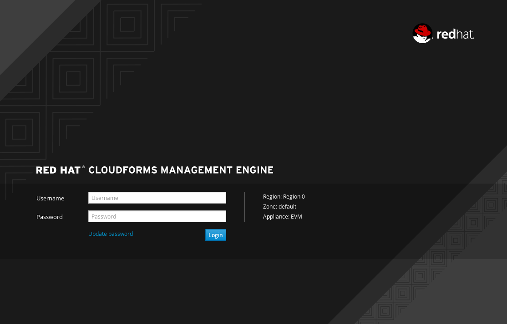
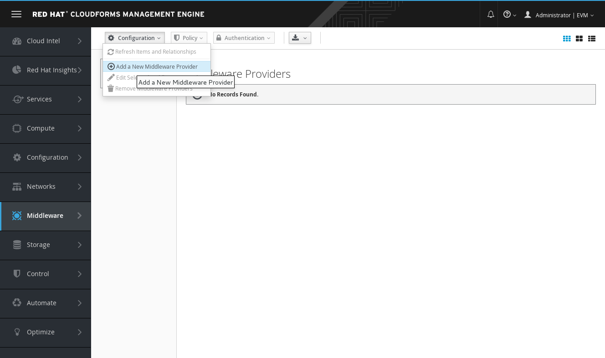
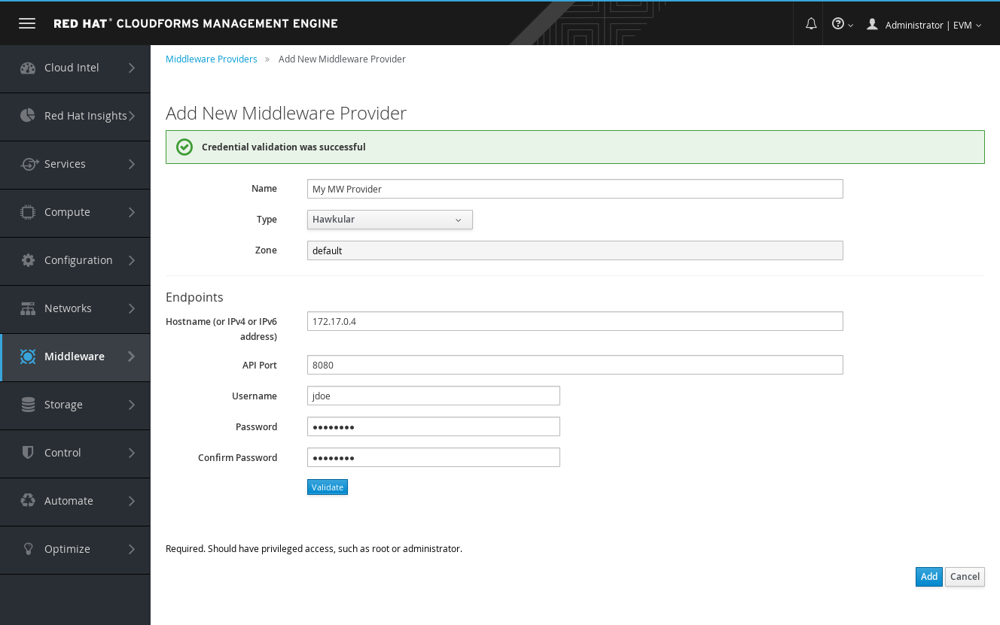

= Adding a Middleware Provider in Red Hat CloudForms

Now that CloudForms and the Middleware manager has been correctly installed, it
is time to add the Middlware manager as a CloudForms Middleware Provider.

To do so, go to http://my_cfme_host/ and login with a user who is allowed to
add providers. The default user is `admin` with `smartvm` for his password.

Then go to "Middleware>Configuration>Add a New Middleware Provider"

Fill-in the details with the IP address and port of the Middleware manager, the username
and password used to start the Middleware manager then validate (my_mwmanager_username and my_mwmanager_password)

Once validated, press the add button and view the summary for the Middleware provider.

image:../mwmanager-images/mw_provider_summary.png[alt="Validate data"]
