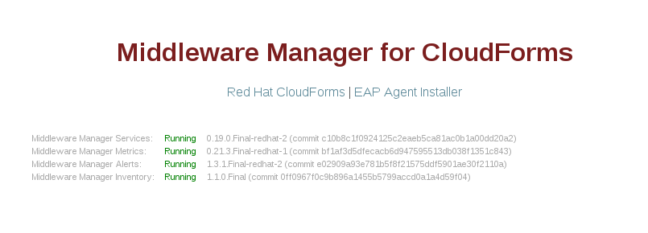

= Installing the Red Hat Middleware Manager

== Installation of Cassandra container

[source, bash]
----
docker run --name mwmanager-cassandra -d brew-pulp-docker01.web.prod.ext.phx2.redhat.com:8888/jboss-mm-7-tech-preview/middleware-manager-datastore:latest
----

[NOTE]
====
By default the Cassandra container will create a volume under
`/opt/apache-cassandra/data`.  This container directory will automatically be
mapped to a unique local directory which can be viewed using
"docker inspect <container-id>".  The "-v" option can be used to map the
Cassandra data volume to a specific host directory.
[source, bash]
----
docker run --name mwmanager-cassandra -d -e CASSANDRA_START_RPC=true \
           -v /tmp/mydatadir:/opt/apache-cassandra/data:Z \
           registry.access.redhat.com/jboss-mm-7-tech-preview/middleware-manager-datastore:latest
----

The "Z" option is necessary on RHEL/Fedora based systems to correctly set the selinux permissions.
====

With this command we are starting our first Cassandra node.
We can verify that the server is running, with the following command:
[source, bash]
----
docker ps
----

.Result
----
CONTAINER ID   IMAGE                                                                         COMMAND                  CREATED          STATUS          PORTS                                         NAMES
34a75ba45be8   brew-pulp-docker01.web.prod.ext.phx2.redhat.com:8888/jboss-mm-7-tech-preview/middleware-manager-datastore:latest   "/docker-entrypoint.s"   44 seconds ago   Up 44 seconds   7000-7001/tcp, 7199/tcp, 9042/tcp, 9160/tcp   mwmanager-cassandra
----

We can see the node information with this command:
[source, bash]
----
docker exec -it <container_id> /opt/apache-cassandra/bin/nodetool info
----

== Installation of the Middleware Manager server

Now we can launch our Middleware Manager container and tell it to connect to Cassandra (change my_db_username, my_db_password and my_db_host to the values
used when you configure PostgreSQL, and set a new combination of username/password for HAWKULAR_USERNAME and HAWKULAR_PASSWORD)

[source, bash]
----
docker run --name mwmanager  -d \
          -e HAWKULAR_BACKEND=remote   \
          -e CASSANDRA_NODES=mwmanager-cassandra \
          -e HAWKULAR_INVENTORY_JDBC_URL=jdbc:postgresql://my_db_host:5432/mwmanager \
          -e HAWKULAR_INVENTORY_JDBC_USERNAME=my_db_username \
          -e HAWKULAR_INVENTORY_JDBC_PASSWORD=my_db_password \
          -e HAWKULAR_USERNAME=my_mwmanager_username \
          -e HAWKULAR_PASSWORD=my_mwmanager_password \
          -p 8080:8080 -p 8443:8443 -p 9990:9990 \
          --link=mwmanager-cassandra \
          brew-pulp-docker01.web.prod.ext.phx2.redhat.com:8888/jboss-mm-7-tech-preview/middleware-manager:latest
----

.Docker container options
|=======
|Name|Default|Description
|ADD_HAWKULAR_USER|true|Whether to add a user to hawkular before the server starts
|HAWKULAR_USERNAME|jdoe|Username for the new user
|HAWKULAR_PASSWORD|password|Password for the new user
|CASSANDRA_NODES|myCassandra|The hostname or IP of Cassandra
|HAWKULAR_METRICS_TTL|14|
|DB_TIMEOUT|-|If set, will wait for specified number of seconds for Cassandra to start before starting Hawkular
|HAWKULAR_INVENTORY_JDBC_URL|-|For example, jdbc:postgresql://my_db_host:5432/mwprovider
|HAWKULAR_INVENTORY_JDBC_USERNAME|-|PostgreSQL username
|HAWKULAR_INVENTORY_JDBC_PASSWORD|-|PostgreSQL password
|=======

To verify the setup, we can reach `http://my_mwmanager_host:8080`, and after a minute or two, we should see:

