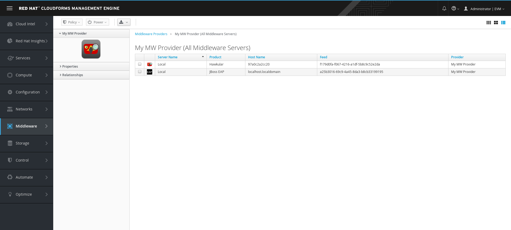

= Instrument Enterprise Application Server 7

To instrument an EAP server and be able to monitor and manage it from CloudForms,
we first need to embed an agent within the server.

The EAP agent installer is available within the Middleware manager. We need to access
`http://my_mwmanager:8080/`, click on the link "EAP Agent Installer" then
enter the credentials for the Middleware Manager:
image:../mwmanager-images/homepage.png[alt="Middleware Manager Homepage"]

It will download a file name `hawkular-wildfly-agent-installer.jar` that we need
to copy on the same host as the EAP server that we want to instrument.

Once downloaded we run the following command to install the embedded agent:

[source, bash]
----
java -jar ~Downloads/hawkular-wildfly-agent-installer.jar
   --target-location=/opt/jboss-eap-7.0/
   --server-url=http://192.168.1.123:8080
   --username=my_mwmanager_username
   --password=my_mwmanager_password
----

Once installed, start or restart EAP, then access the Middleware Provider that was
already configured in CloudForms.

WARNING: The new WildFly server will not appear immediately

